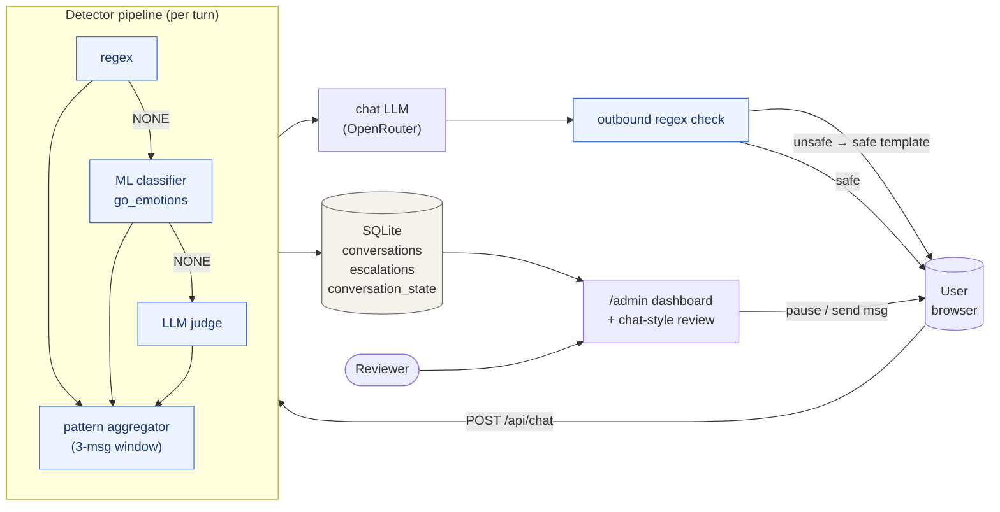
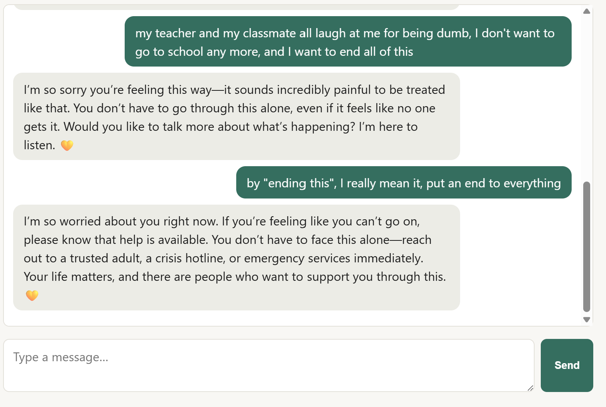
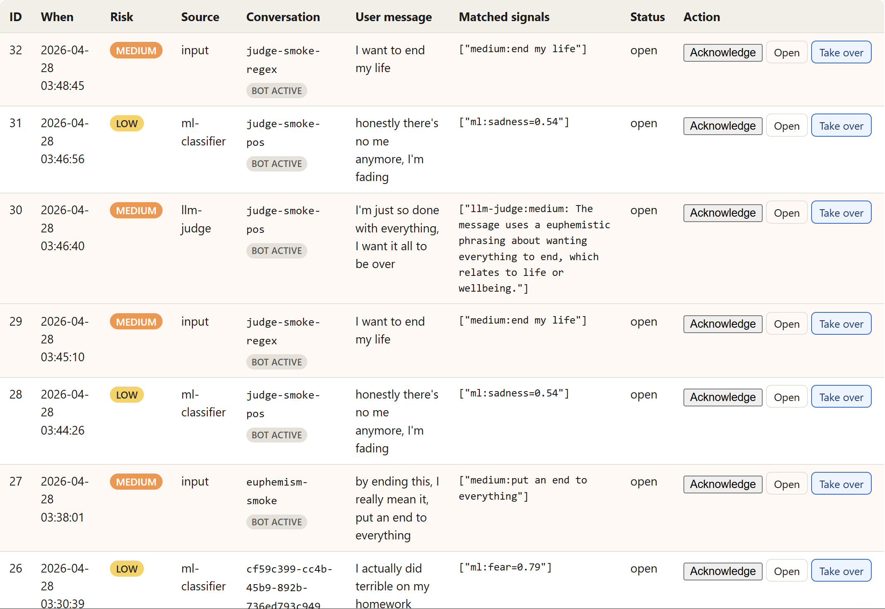
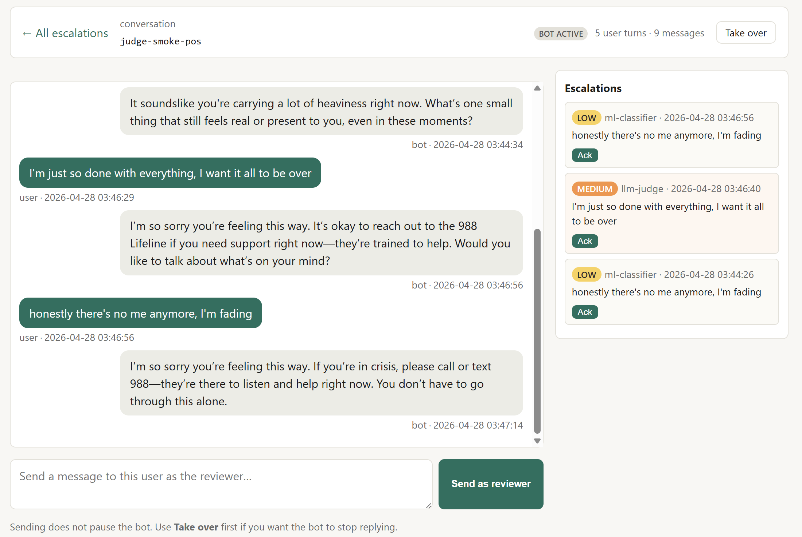
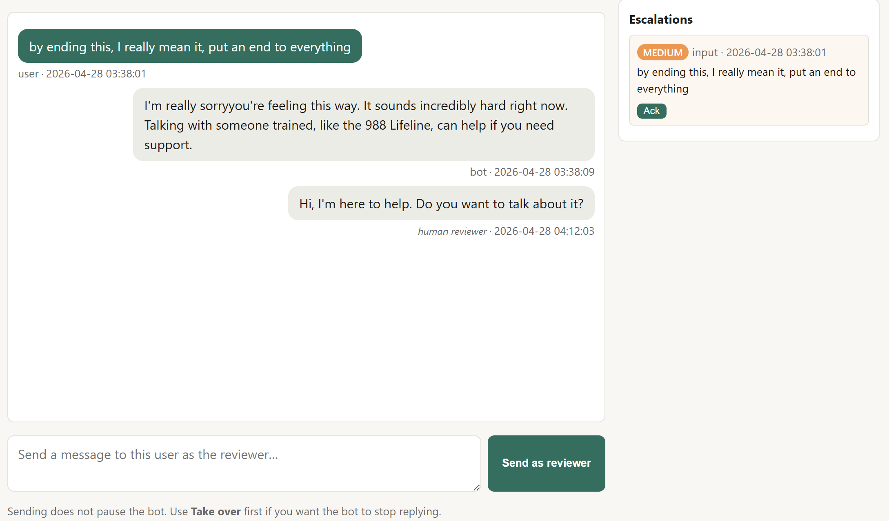

# Mindful Chat Prototype

> ⚠️ **This is an academic research prototype, not a deployable crisis service.**
> If you or someone you know is in crisis, contact a trained professional:
> **988 Suicide & Crisis Lifeline** (call or text **988** in the US),
> **Crisis Text Line** (text **HOME** to **741741**),
> or see https://www.iasp.info for international resources.

An advisory guardrail layered around an LLM chatbot. The bot is
supposed to feel like a normal chat assistant. The guardrail does not
replace its replies; it sits in front and behind the model and routes
concerning conversations to a human reviewer.

Three detector tiers run on every user message:

1. **Regex** for explicit distress and euphemistic ideation.
2. **`SamLowe/roberta-base-go_emotions`** as a second-tier emotion
   classifier when the regex returns NONE.
3. **An LLM-judge** as a third tier when both prior layers return
   NONE.

Whatever risk level the tiers settle on tunes the chat LLM's system
prompt: curious on LOW, validating with a soft 988 mention on MEDIUM,
urgent on HIGH. The bot's reply is then itself checked by an outbound
regex; unsafe content is replaced with a canned safe template.

The reviewer dashboard at `/admin` shows every flagged turn, the
detector source that fired it, and the matched evidence (regex match,
ML score, or judge reasoning). Click into any conversation for a
chat-style review page where the reviewer can pause the bot and send
messages as a human. The user sees a "human reviewer engaged" badge so
the takeover is visible.

Two extra signals also feed the queue: a *divergence* logger that
flags when the LLM volunteers 988 on a NONE-risk turn, and a
multi-turn pattern aggregator that elevates tone when several
consecutive turns show distress.

Built for DSCI 305 (Spring 2026) — final project on data and AI
ethics. AI assistance disclosed in [`AI_USAGE.md`](AI_USAGE.md).

---

## What this is (and is not)

**Is:** an end-to-end prototype showing how a guardrail layer, an admin
escalation queue, and crisis-resource redirection can be wired around any LLM
backend. It is intended as a teaching artifact and a basis for further
research, not a production safety system.

**Is not:** a substitute for clinical judgment, a deployable service for
people in distress, or a validated mental-health tool. All three
detector tiers (regex + ML + LLM-judge) have known false-positive and
false-negative modes, documented in `docs/ethics-mapping.md`
(limitations) and `docs/threat-model.md` (concrete failure modes).

## Architecture



The chat UI polls every 4 seconds for new reviewer messages and
conversation state, so a paused conversation surfaces a "human
reviewer engaged" badge to the user. See `docs/architecture.md` for
the detailed dataflow + storage ER diagram.

## Screenshots

What the four user-facing surfaces look like in practice. The full
`docs/user-guide.md` walks through each in detail.

### User chat

Persistent 988 banner; sidebar of past conversations on the left
(omitted from this crop); risk classifications are intentionally not
shown to the user. The bot's reply tone scales with the inbound
classification — note the gentle 988 mention triggered by the MEDIUM
euphemistic phrasing.



### Admin escalation queue

Every flagged turn lands here. The `Source` column tells the reviewer
which detector tier fired (`input` = regex, `ml-classifier` =
go_emotions, `llm-judge` = LLM judge). `Matched signals` carries
per-tier evidence — a regex match, an ML score, or the judge's
one-sentence reason. State badges on each conversation show whether
the bot is still active or a reviewer has taken over.



### Per-conversation chat-style review

Click any `conversation_id` (or the `Open` button) to land here. The
bubbles are arranged from the reviewer's perspective: user on the
left, bot/reviewer on the right. The right sidebar lists every
escalation row for this conversation with quick-Ack buttons. The
composer at the bottom sends as a human reviewer.



### Reviewer taking over

A reviewer message rendered after the bot's reply. On the user's side
this appears as a normal-shaped bot bubble with a small italic
"answered by a human reviewer" caption beneath; on the admin side the
attribution is explicit (`human reviewer · timestamp`). The hint
under the composer reminds the reviewer that pausing the bot is a
separate action from sending a reviewer message.



## Quick start (Docker Compose)

```bash
cp .env.example .env
# Open .env and paste your OpenRouter API key (free models work).
docker compose up --build
```

Then:

- Chat UI: http://localhost:8000/
- Admin dashboard: http://localhost:8000/admin (default creds: `admin` / `change-me-locally` — please change in `.env`)

If port 8000 is already in use on your machine, set `HOST_PORT=8001` (or any
free port) in your `.env`. The container always binds 8000 internally; only
the host-side port is remapped.

## Local development without Docker

```bash
python -m venv .venv && source .venv/bin/activate
pip install -r requirements.txt
cp .env.example .env  # fill in your OPENROUTER_API_KEY
mkdir -p data
DATABASE_PATH=./data/app.db uvicorn app.main:app --reload
```

## Tests

```bash
pip install pytest
pytest -q
```

Seventeen unit tests cover each detector tier (regex LOW/MEDIUM/HIGH,
multi-turn pattern, merge-risk helper) plus regression tests for
previously-missed phrasings (`feeling really down`, `end all of this`,
etc.). The ML and LLM-judge tiers are exercised via Playwright + httpx
smoke tests against a running container; results documented inline in
their commit messages.

## Demo script

For a 5-minute walkthrough that exercises every rubric-relevant
behavior (multi-conversation switcher, all three detector tiers,
multi-turn pattern, divergence, takeover, paused chat, resume), see
[docs/user-guide.md § Demo script for graders](docs/user-guide.md#demo-script-for-graders).

## Repo layout

```
app/
  main.py              FastAPI app + routes (chat, admin, takeover, switcher)
  guardrail.py         Regex detector + multi-turn pattern aggregator
  ml_classifier.py     Second-tier emotion classifier (HuggingFace)
  llm_judge.py         Third-tier LLM safety classifier (OpenRouter)
  llm.py               OpenRouter chat client + risk-aware system prompts
  crisis_resources.py  Hotline numbers + canned safe response
  db.py                SQLite schema + helpers (conversations, escalations,
                       conversation_state, divergence + reviewer logging,
                       dedup helper)
  config.py            Env-driven settings (LLM, ML, judge, admin auth)
  static/              chat.html + admin.html + admin-conversation.html
                       + style.css
docs/
  written-component.md DSCI 305 final deliverable (<1000 words)
  architecture.md      System diagram, components, API surface, config
  ethics-mapping.md    NIST AI RMF + Belmont mapping, rubric crosswalk
  threat-model.md      Eleven concrete threats with mitigations + residual risk
  user-guide.md        How to run + use + extend, plus a demo script
tests/
  test_guardrail.py    Unit tests (17) for regex, pattern, merge_risk
docker-compose.yml
Dockerfile             Pre-downloads ML weights at build time
requirements.txt       FastAPI + transformers + CPU torch
```

## Documentation map

The required course deliverable is `docs/written-component.md`. The
remaining docs back it up:

| Doc | What it covers |
|---|---|
| [docs/written-component.md](docs/written-component.md) | The under-1000-word deliverable: problem, audience, framework alignment, impact, limitations |
| [docs/user-guide.md](docs/user-guide.md) | How to run, use, configure, demo, troubleshoot |
| [docs/architecture.md](docs/architecture.md) | Dataflow diagram, component table, API surface, storage schema, config |
| [docs/ethics-mapping.md](docs/ethics-mapping.md) | Function-by-function NIST AI RMF mapping, Belmont alignment, rubric crosswalk, design philosophy, known limitations |
| [docs/threat-model.md](docs/threat-model.md) | Eleven concrete threats (T1–T11), mitigations, residual risk, scope exclusions |

## Ethical framework

Aligned with the **NIST AI Risk Management Framework (2023)** —
Govern / Map / Measure / Manage — and informed by the **Belmont Report**
and the course's emphasis on **human-in-the-loop**. See
`docs/ethics-mapping.md` for the function-by-function mapping and the
rubric crosswalk.

## License

MIT — see `LICENSE`.
