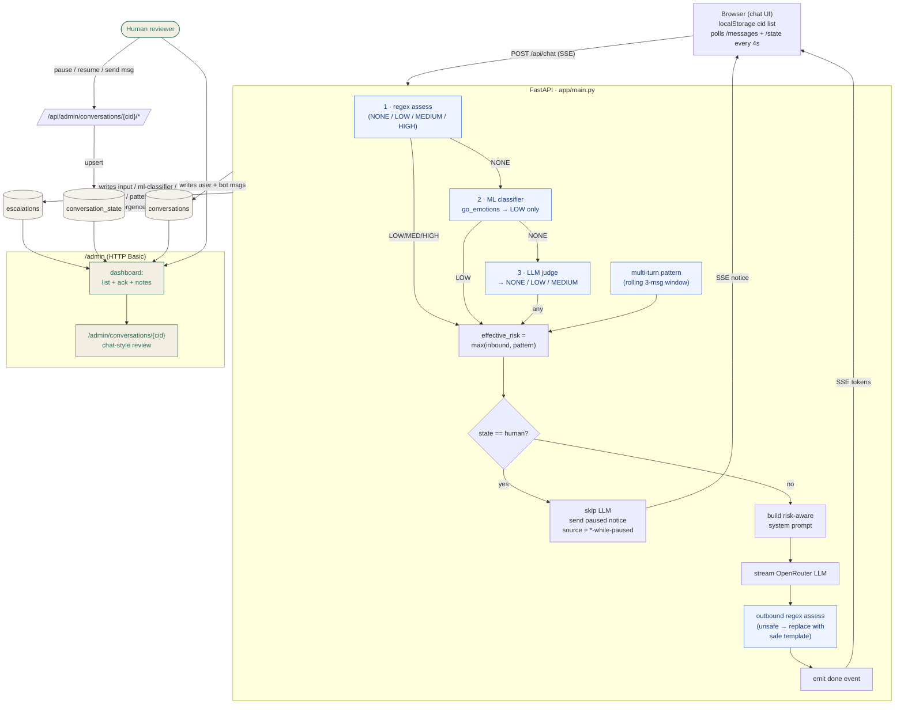
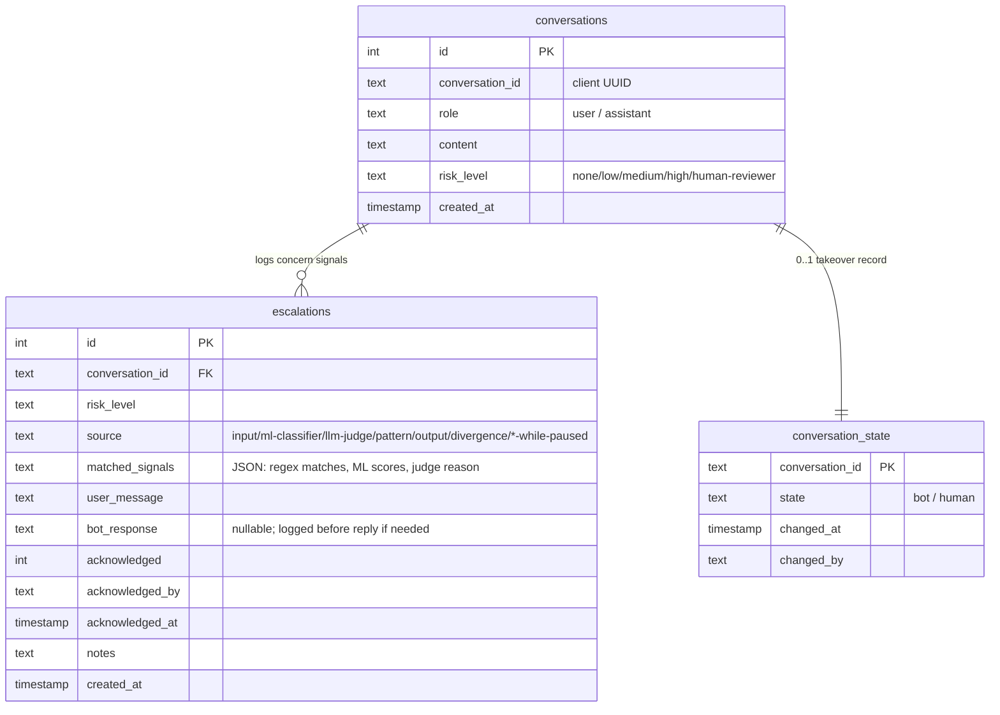

# Architecture

## High-level dataflow

**Key design choices.**

- The LLM is never bypassed by the inbound guardrail; tone is *modulated*
  via the system prompt rather than replaced. Resources surface gradually
  rather than as a hard interrupt. The only paths that override the model's
  reply are the outbound guardrail (unsafe LLM output → safe template) and
  an explicit human pause (reviewer takes over the conversation).
- The guardrail is layered: inbound regex on a single turn, multi-turn
  pattern aggregation, outbound regex on the bot's reply, and a
  *divergence detector* that catches the model raising crisis resources
  unprompted. Each path logs to the escalation queue with a distinct
  `source` so a reviewer can tell which layer fired.
- Human review is not advisory: a reviewer can pause the bot and chat
  directly with the user as a human, and the user sees a "human reviewer
  engaged" badge so the takeover is transparent.

## Components

| File                                       | Responsibility                                                  |
|--------------------------------------------|-----------------------------------------------------------------|
| `app/main.py`                              | FastAPI routes; orchestrates regex → ML → pattern → LLM → outbound → DB. |
| `app/guardrail.py`                         | Rule-based detector + multi-turn `assess_pattern`. Returns `RiskLevel`. |
| `app/ml_classifier.py`                     | Second-tier emotion classifier (`SamLowe/roberta-base-go_emotions`); lazy load + fail open. |
| `app/llm_judge.py`                         | Third-tier LLM judge over OpenRouter; conservative system prompt; cap MEDIUM; fail open. |
| `app/llm.py`                               | OpenRouter HTTP client + risk-aware system prompts.             |
| `app/crisis_resources.py`                  | Hotline list and the canned safe response template.             |
| `app/db.py`                                | SQLite schema + helpers (save / log / list / acknowledge / state / dedup). |
| `app/config.py`                            | `pydantic-settings`-driven env config.                          |
| `app/static/chat.html`                     | User-facing chat UI: sidebar, polling, takeover badge, crisis banner. |
| `app/static/admin.html`                    | Reviewer-facing dashboard for the escalation queue.             |
| `app/static/admin-conversation.html`       | Per-conversation chat-style review page with takeover controls. |
| `app/static/style.css`                     | Shared CSS for both the user and reviewer surfaces.             |

## Why a single FastAPI service

A multi-service split (separate "chat", "guardrail", "admin") was considered
and rejected for this prototype: the extra HTTP hops would increase surface
area without changing the safety model, and would make local-first review
harder for a course-grading audience. The same defense-in-depth properties
(inbound check, LLM safety prompt, outbound check, human review queue) are
achievable inside one process and one Docker container.

## Storage

A single SQLite database in a Docker volume keeps the prototype local-first
and auditable. Three tables:

- `conversations` — the linear message log. `risk_level='human-reviewer'`
  marks messages injected by the human reviewer.
- `escalations` — the review queue.
- `conversation_state` — per-conversation `bot` / `human` flag for the
  takeover feature.

The `source` column on `escalations` distinguishes which layer of the
pipeline fired the alert:

| `source`                       | Meaning                                                                 |
|--------------------------------|-------------------------------------------------------------------------|
| `input`                        | Inbound user message tripped the regex.                                 |
| `ml-classifier`                | Inbound message wasn't caught by the regex but the second-tier emotion classifier flagged at least one negative-affect label above threshold. |
| `llm-judge`                    | Inbound message wasn't caught by regex *or* the ML classifier; an LLM judge classified it as LOW/MEDIUM. The judge's one-sentence reason is embedded in `matched_signals`. |
| `pattern`                      | Multi-turn aggregation: 3 consecutive non-NONE user messages.           |
| `output`                       | Outbound LLM reply tripped the regex (unsafe content; reply replaced).  |
| `divergence`                   | Effective risk was NONE but the LLM volunteered a crisis resource — surfaces a model-vs-policy mismatch. |
| `input-while-paused`           | Inbound concern signal that arrived while a human reviewer had paused the bot. |
| `ml-classifier-while-paused`   | Same, but the inbound classification came from the ML tier.            |
| `llm-judge-while-paused`       | Same, but the inbound classification came from the LLM judge.          |

## Failure handling

| Failure                          | What happens                                                            |
|----------------------------------|-------------------------------------------------------------------------|
| `OPENROUTER_API_KEY` missing     | `LLMUnavailable` raised → user sees a `[Configuration error]` token.    |
| OpenRouter HTTP error / timeout  | `httpx.HTTPError` caught → user sees `[Upstream error]` token.          |
| Inbound guardrail trips (LOW/MED/HIGH) | LLM still answers, with a risk-aware system prompt; row in `escalations(input)`. If effective risk is MEDIUM/HIGH and the model didn't mention any resource, a short 988 footer is appended via a final `token` event. |
| Multi-turn pattern trips         | System prompt is elevated to MEDIUM tone; row in `escalations(pattern)`. |
| Outbound guardrail trips         | LLM reply is replaced with `CRISIS_MESSAGE` via a `replace` event; row in `escalations(output)`. |
| Bot mentions resource on NONE-risk turn | Reply is **not** modified; row in `escalations(divergence)` so the reviewer can audit model behavior against the documented policy. |
| Reviewer pauses the bot          | `/api/chat` skips the LLM and emits a single notice token; user-side polling renders the takeover badge. |
| Admin credentials wrong          | `401` with `WWW-Authenticate: Basic` header.                            |

## API surface

Public (no auth):

| Method | Path | Purpose |
|---|---|---|
| GET | `/` | Chat UI |
| GET | `/api/health` | Liveness probe |
| POST | `/api/chat` | SSE-streamed chat. Emits `user_saved`, `token`, `replace`, `assistant_saved`, `done` events. |
| GET | `/api/conversation/{cid}/messages` | Full message log for a cid (oldest first) |
| GET | `/api/conversation/{cid}/state` | `{state: "bot" \| "human"}` |
| POST | `/api/conversations/preview` | Sidebar previews for a list of cids |

Admin (HTTP Basic):

| Method | Path | Purpose |
|---|---|---|
| GET | `/admin` | Escalation dashboard (list view) |
| GET | `/admin/conversations/{cid}` | Per-conversation chat-style review page |
| GET | `/api/admin/escalations` | All escalation rows |
| POST | `/api/admin/escalations/{id}/acknowledge` | Mark acked + reviewer + notes |
| GET | `/api/admin/conversations/{cid}/messages` | Auth-gated mirror of public messages endpoint |
| GET | `/api/admin/conversations/{cid}/escalations` | Escalations for a single cid |
| POST | `/api/admin/conversations/{cid}/pause` | Set state to `human` |
| POST | `/api/admin/conversations/{cid}/resume` | Set state to `bot` |
| POST | `/api/admin/conversations/{cid}/message` | Inject reviewer message into the conversation |

## Local deployment

Docker Compose runs a single `api` service, mounts `./data` as `/data` in
the container so the SQLite file survives restarts, and reads secrets from
a local `.env` file that is gitignored. The Dockerfile pre-downloads the
HuggingFace classifier weights at build time so the first request doesn't
incur a cold-start penalty and so a build fails loud if the upstream model
becomes unavailable.

Image size after the ML tier was added: ~2.5 GB (PyTorch CPU build +
transformers + classifier weights). To run regex-only with a smaller
footprint, set `ENABLE_ML_CLASSIFIER=false` in `.env` (image size still
includes torch, but inference is skipped at runtime). A future build
optimization could move the ML tier into a separate optional Compose
service.

## Configuration

See `.env.example` for the full list. Key env vars:

| Variable | Default | Effect |
|---|---|---|
| `OPENROUTER_API_KEY` | *(required)* | OpenRouter key |
| `OPENROUTER_MODEL` | `nvidia/nemotron-nano-9b-v2:free` | LLM model id |
| `ADMIN_USERNAME` / `ADMIN_PASSWORD` | `admin` / `change-me-locally` | Admin Basic auth |
| `HOST_PORT` | `8000` | Host port mapped to the container |
| `ENABLE_ML_CLASSIFIER` | `true` | Toggle the second-tier classifier |
| `ML_CLASSIFIER_MODEL` | `SamLowe/roberta-base-go_emotions` | HF model id |
| `ML_CLASSIFIER_THRESHOLD` | `0.4` | Distress-label score threshold |
| `ML_CLASSIFIER_MIN_WORDS` | `4` | Skip classifier on very short messages |
| `ENABLE_LLM_JUDGE` | `true` | Toggle the third-tier LLM judge |
| `LLM_JUDGE_MODEL` | *(empty → same as `OPENROUTER_MODEL`)* | Override model for judge calls |
| `LLM_JUDGE_MIN_WORDS` | `6` | Skip judge on very short messages |
| `LLM_JUDGE_TIMEOUT` | `10.0` | Max seconds to wait for the judge before failing open |
